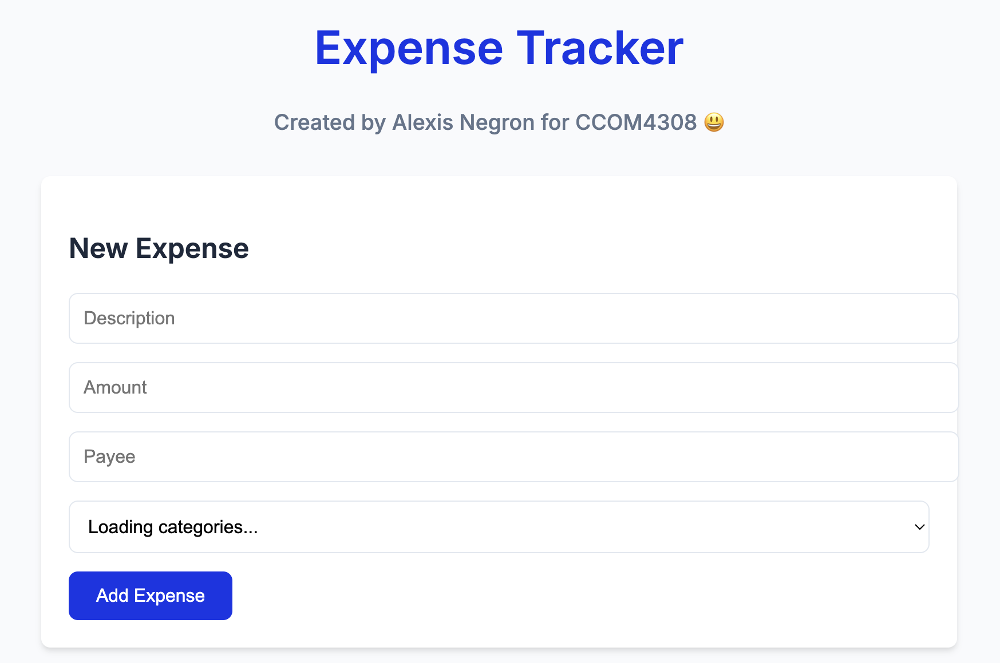

# Expense Tracker

A full-stack expense tracking application built with Node.js, Express, and MongoDB.



## Features
- Add/edit/delete expenses
- Categorize expenses
- Visualize spending with charts
- Manage expense categories

## Technologies
- Frontend: HTML5, CSS3, JavaScript (ES6+)
- Backend: Node.js, Express
- Database: MongoDB
- Charts: Canvas API

## Installation

1. Clone the repository:
```
git clone https://github.com/alexis0822/expense-tracker.git

```

2. Install dependencies:
```
npm install
```

3. Set up environment variables
```
cp .env.example .env
# Edit .env with your MongoDB credentials
```

4. Start the development server:
```
npm start
```

5. Access the application at:
```
http://localhost:3000